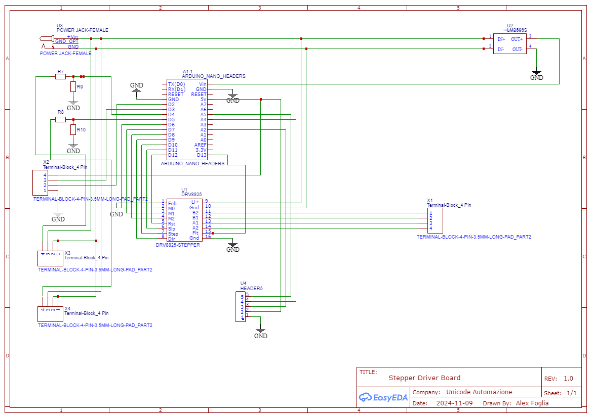

# StepperDriverController

Stepper motor controller board using the DRV8825 driver and Arduino Nano as microcontroller.

## Driver board

### Schematic

### PCB

## Controller board

### Schematic

### PCB

